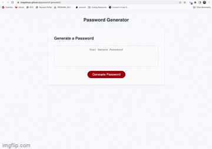

# Password Generator

## Technology Used 

|Technology | Resource |
|-----|:-----------|
| Git | [https://git-scm.com/](https://git-scm.com/)  
| JavaScript | [https://developer.mozilla.org/](https://developer.mozilla.org/en-US/docs/Web/JavaScript) |
| HTML |[https://developer.mozilla.org/](https://developer.mozilla.org/en-US/docs/Web/HTML)|
|CSS | [https://developer.mozilla.org/](https://developer.mozilla.org/en-US/docs/Web/CSS)|

## Description

[Click here to view Deployed Site](https://megellman.github.io/password-generator/)



## Table of Contents
* [Code Example](#code-example)
* [Learning Points](#learning-points)
* [Author Info](#author-info)
* [Credits](#credits)
* [License](#license)

## Code Example
To randomly generate a password, I used a for loop that will randomly select a character from the password criteria selected and add it to the new variable pass. This process will iterate the number of times selected for the password length and when it is done, it will return a randomly generated password.
```
for (var i = 0; i <= passwordLength; i++) {
    var pass;
    var randomNumber = Math.floor(Math.random() * passwordContainer.length + 1);
    pass += passwordContainer.charAt(randomNumber)
    console.log(pass);
}
return pass;
```
## Learning Points
### concat()
This method was extremely helpful in generating a passwordContainer variable based on the user's selected password criteria. Each time a user selected a given criteria, for example, lowercase letters, I concatenated that variable with the passwordContainer variable. This makes it easy to add new criteria variables as well. 
### Math.floor(Math.random)
This formula was extremely useful in creating a way to randomly generate a given number. The use cases for this formula are numerous, but in this circumstance it was used to randomly generate a number between 1 and the password length selected to iterate and pull out a number from the passwordContainer variable to create a new password.
```
var randomNumber = Math.floor(Math.random() * passwordContainer.length + 1);
```


## Author Info

### Megan Ellman
[LinkedIn](https://www.linkedin.com/in/megan-ellman/)

[GitHub](https://github.com/megellman)

[Portfolio](https://megellman.github.io/portfolio/)

## Credits 

|Resource | Link |
|-------|:-------|
| Math.random() | [https://developer.mozilla.org/](https://developer.mozilla.org/en-US/docs/Web/JavaScript/Reference/Global_Objects/Math/random)  |
|  Array Methods and Properties | [https://www.w3schools.com/](https://www.w3schools.com/jsref/jsref_obj_array.asp)   |
| String Methods | [https://www.w3schools.com/](https://www.w3schools.com/js/js_string_methods.asp)|
## License
MIT License

Copyright (c) [2022] [Megan Ellman]

Permission is hereby granted, free of charge, to any person obtaining a copy
of this software and associated documentation files (the "Software"), to deal
in the Software without restriction, including without limitation the rights
to use, copy, modify, merge, publish, distribute, sublicense, and/or sell
copies of the Software, and to permit persons to whom the Software is
furnished to do so, subject to the following conditions:

The above copyright notice and this permission notice shall be included in all
copies or substantial portions of the Software.

THE SOFTWARE IS PROVIDED "AS IS", WITHOUT WARRANTY OF ANY KIND, EXPRESS OR
IMPLIED, INCLUDING BUT NOT LIMITED TO THE WARRANTIES OF MERCHANTABILITY,
FITNESS FOR A PARTICULAR PURPOSE AND NONINFRINGEMENT. IN NO EVENT SHALL THE
AUTHORS OR COPYRIGHT HOLDERS BE LIABLE FOR ANY CLAIM, DAMAGES OR OTHER
LIABILITY, WHETHER IN AN ACTION OF CONTRACT, TORT OR OTHERWISE, ARISING FROM,
OUT OF OR IN CONNECTION WITH THE SOFTWARE OR THE USE OR OTHER DEALINGS IN THE
SOFTWARE.